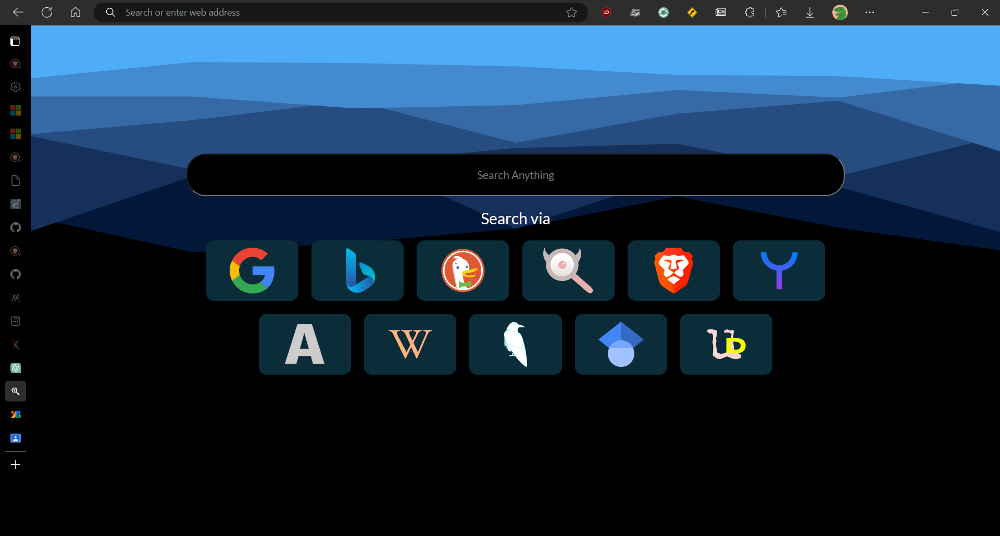

- Download the repository to your computer and unzip it.
- Enable 'Developer mode' in extension settings.
- Select the 'Load Unpacked' option and select the previously unzipped folder.
- Enable the extension and boom!

## Screenshots

